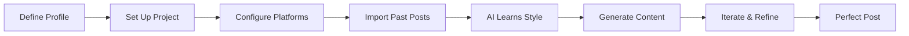
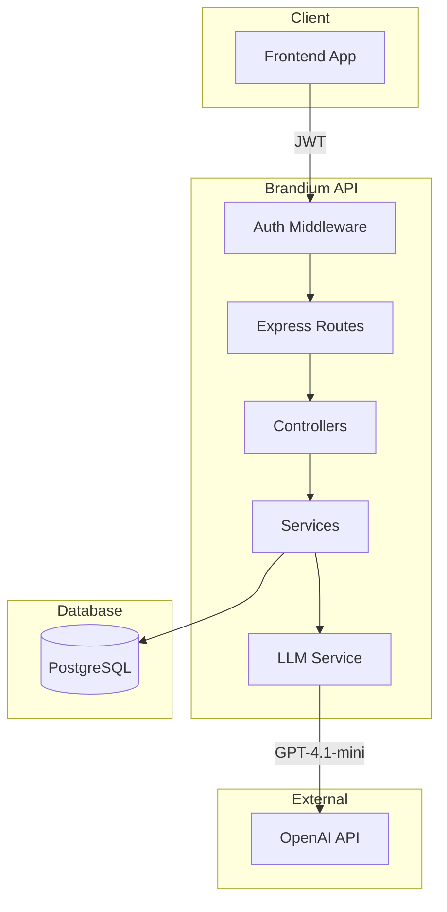
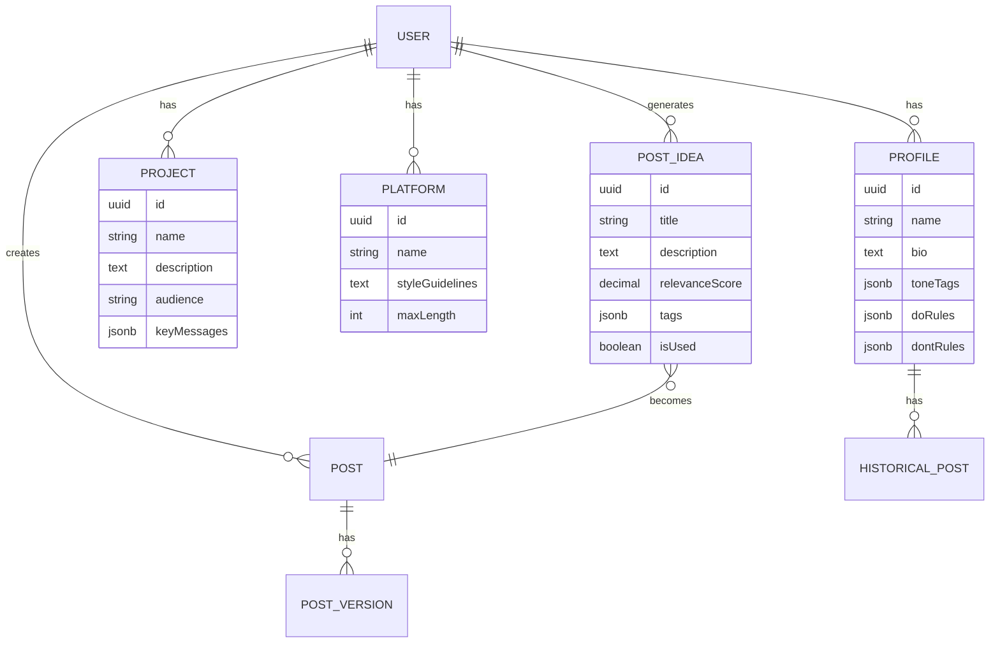
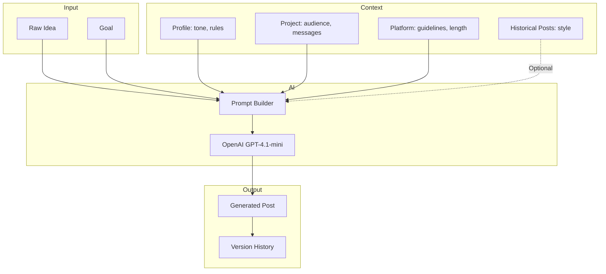
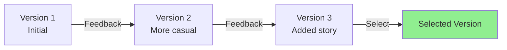
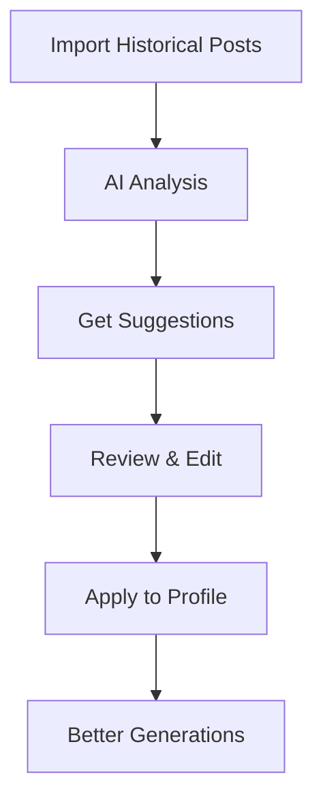

# Brandium Backend API

[](https://github.com/TristanHourtoulle/brandium-backend/actions/workflows/ci.yml)
[](https://codecov.io/gh/TristanHourtoulle/brandium-backend)
[](https://opensource.org/licenses/MIT)
[](https://nodejs.org/)
[](https://www.typescriptlang.org/)
[](https://expressjs.com/)
[](https://www.postgresql.org/)

**Generate personalized social media content using AI while maintaining your unique voice.**

---

## Table of Contents

- [What is Brandium?](#what-is-brandium)
- [Features](#features)
- [Quick Start](#quick-start)
- [Core Concepts](#core-concepts)
- [Complete Workflow Example](#complete-workflow-example)
- [Features Deep Dive](#features-deep-dive)
- [API Reference](#api-reference)
- [Data Models](#data-models)
- [Development](#development)
- [Deployment](#deployment)
- [License](#license)

---

## What is Brandium?

Brandium is a backend API that helps you **generate personalized social media posts** using AI. It learns your writing style, understands your audience, and creates content that sounds authentically like you.

### The Problem

Creating engaging social media content is time-consuming:

- Maintaining consistent tone across platforms
- Adapting content for different audiences
- Following platform-specific best practices
- Staying true to your brand voice

### The Solution

Brandium learns your writing style and generates content in your voice:



### Architecture Overview



---

## Features

| Feature | Description |
|---------|-------------|
| **Authentication** | JWT-based auth with bcrypt password hashing |
| **Multi-Profile** | Create multiple personas with unique tones and rules |
| **Projects** | Organize content by project with target audiences |
| **Multi-Platform** | Configure LinkedIn, X, TikTok, etc. with style guidelines |
| **AI Generation** | Generate posts using OpenAI GPT-4.1-mini |
| **Post Iterations** | Refine posts with AI-powered iterations and version history |
| **Historical Posts** | Import past posts for AI learning |
| **AI Analysis** | Automatically analyze writing style from your content |
| **AI Ideas** | Generate creative post ideas based on your context |
| **Rate Limiting** | Built-in protection against API rate limits |

---

## Quick Start

### Prerequisites

- Node.js 20+
- PostgreSQL 14+ (`brew install postgresql@14` on macOS)
- OpenAI API key

### Installation

```bash
# 1. Clone the repository
git clone https://github.com/TristanHourtoulle/brandium-backend.git
cd brandium-backend

# 2. Install dependencies
npm install

# 3. Configure environment
cp .env.example .env
# Edit .env with your values (especially OPENAI_API_KEY and JWT_SECRET)

# 4. Setup database
npm run setup

# 5. Run migrations
npm run db:migrate

# 6. (Optional) Seed demo data
npm run db:seed

# 7. Start the server
npm run dev
```

Server runs on `http://localhost:5000`

### Verify Installation

```bash
# Health check
curl http://localhost:5000/health

# Expected response
{"status":"ok","timestamp":"2024-..."}
```

---

## Core Concepts

Brandium uses four main entities to generate personalized content:



### 1. Profiles (Personas)

A profile represents **your voice and tone**. You can have multiple profiles for different contexts (professional, casual, thought leader, etc.).

```json
{
  "name": "Tech Thought Leader",
  "bio": "CTO sharing insights on AI and software architecture",
  "toneTags": ["professional", "insightful", "approachable"],
  "doRules": [
    "Use concrete examples from real experience",
    "Ask thought-provoking questions",
    "Share actionable insights"
  ],
  "dontRules": [
    "Avoid jargon overload",
    "Don't be overly promotional",
    "Never use clickbait"
  ]
}
```

### 2. Projects

A project defines **what you're promoting** and **who you're talking to**.

```json
{
  "name": "Edukai Launch",
  "description": "AI-powered learning platform for developers",
  "audience": "Software developers looking to upskill",
  "keyMessages": [
    "Learn 3x faster with adaptive AI",
    "Personalized learning paths",
    "Real-world projects"
  ]
}
```

### 3. Platforms

Platforms define **where you're posting** and platform-specific guidelines.

```json
{
  "name": "LinkedIn",
  "styleGuidelines": "Professional tone, use line breaks for readability, include a call-to-action",
  "maxLength": 3000
}
```

### 4. LinkedIn Post Formats

Brandium automatically detects and applies the optimal format based on your goal:

| Format | Use When | Structure |
|--------|----------|-----------|
| **Story** | Sharing experiences, lessons learned, failures | Context → Problem/Tension → Lesson → Question |
| **Opinion** | Challenging beliefs, unpopular opinions, hot takes | Hook Line → Argumentation → Personal Proof → Validation |
| **Debate** | Sparking discussion, gathering opinions | Position → Reasoning → Evidence → Call to Action |

The format is automatically detected based on keywords in your `goal` and `rawIdea`. Examples:

- "Share my failure" → **Story** format
- "Unpopular opinion about..." → **Opinion** format
- "What do you think about..." → **Debate** format

### 5. Generation Flow

When you generate a post, Brandium combines all context:



---

## Complete Workflow Example

Here's a step-by-step guide to generate your first post:

### 1. Register & Login

```bash
# Register
curl -X POST http://localhost:5000/api/auth/register \
  -H "Content-Type: application/json" \
  -d '{
    "email": "user@example.com",
    "password": "SecurePass123!"
  }'

# Login (save the token)
curl -X POST http://localhost:5000/api/auth/login \
  -H "Content-Type: application/json" \
  -d '{
    "email": "user@example.com",
    "password": "SecurePass123!"
  }'

# Response: {"token": "eyJhbG...", "user": {...}}
```

### 2. Create Your Profile

```bash
export TOKEN="your-jwt-token"

curl -X POST http://localhost:5000/api/profiles \
  -H "Content-Type: application/json" \
  -H "Authorization: Bearer $TOKEN" \
  -d '{
    "name": "Professional Voice",
    "bio": "Startup founder sharing lessons learned",
    "toneTags": ["authentic", "insightful", "motivational"],
    "doRules": ["Share real experiences", "Be vulnerable about failures"],
    "dontRules": ["No humble bragging", "Avoid generic advice"]
  }'

# Save the profile ID from response
```

### 3. Create a Project

```bash
curl -X POST http://localhost:5000/api/projects \
  -H "Content-Type: application/json" \
  -H "Authorization: Bearer $TOKEN" \
  -d '{
    "name": "Product Launch",
    "description": "Launching our new AI feature",
    "audience": "Tech-savvy professionals aged 25-45",
    "keyMessages": ["Save 10 hours/week", "AI-powered automation"]
  }'
```

### 4. Configure a Platform

```bash
curl -X POST http://localhost:5000/api/platforms \
  -H "Content-Type: application/json" \
  -H "Authorization: Bearer $TOKEN" \
  -d '{
    "name": "LinkedIn",
    "styleGuidelines": "Professional but conversational. Use emojis sparingly. Include a question to drive engagement.",
    "maxLength": 3000
  }'
```

### 5. (Optional) Import Historical Posts

```bash
# Import past posts so AI can learn your style
curl -X POST http://localhost:5000/api/profiles/{profileId}/historical-posts/bulk \
  -H "Content-Type: application/json" \
  -H "Authorization: Bearer $TOKEN" \
  -d '{
    "posts": [
      {
        "content": "Just shipped a feature that took 6 months...",
        "publishedAt": "2024-01-15T10:00:00Z",
        "engagement": {"likes": 245, "comments": 32}
      },
      {
        "content": "The hardest part of being a founder...",
        "publishedAt": "2024-02-20T14:30:00Z",
        "engagement": {"likes": 512, "comments": 78}
      }
    ]
  }'
```

### 6. Analyze Your Writing Style

```bash
# Check if you have enough posts for analysis (minimum 3)
curl -X GET http://localhost:5000/api/profiles/{profileId}/analysis-stats \
  -H "Authorization: Bearer $TOKEN"

# Run AI analysis
curl -X POST http://localhost:5000/api/profiles/{profileId}/analyze-from-posts \
  -H "Authorization: Bearer $TOKEN"

# Apply the suggestions to your profile
curl -X POST http://localhost:5000/api/profiles/{profileId}/apply-analysis \
  -H "Content-Type: application/json" \
  -H "Authorization: Bearer $TOKEN" \
  -d '{
    "applyToneTags": true,
    "applyDoRules": true,
    "applyDontRules": true,
    "applyBio": false
  }'
```

### 7. Generate Your First Post

```bash
curl -X POST http://localhost:5000/api/generate \
  -H "Content-Type: application/json" \
  -H "Authorization: Bearer $TOKEN" \
  -d '{
    "profileId": "your-profile-id",
    "projectId": "your-project-id",
    "platformId": "your-platform-id",
    "goal": "Announce the new AI feature and drive signups",
    "rawIdea": "We just launched adaptive quizzes that learn how you learn"
  }'

# Response includes the generated post and post ID
```

### 8. Iterate & Refine

```bash
# Not happy with the first version? Iterate!
curl -X POST http://localhost:5000/api/posts/{postId}/iterate \
  -H "Content-Type: application/json" \
  -H "Authorization: Bearer $TOKEN" \
  -d '{
    "feedback": "Make it more casual and add a personal anecdote"
  }'

# View all versions
curl -X GET http://localhost:5000/api/posts/{postId}/versions \
  -H "Authorization: Bearer $TOKEN"

# Select the best version
curl -X PATCH http://localhost:5000/api/posts/{postId}/versions/{versionId}/select \
  -H "Authorization: Bearer $TOKEN"
```

---

## Features Deep Dive

### Multi-Profile Support

Create different personas for different contexts. A tech founder might have:

- **Professional**: For LinkedIn thought leadership
- **Casual**: For X/Twitter engagement
- **Educational**: For tutorial content

Each profile maintains its own tone, rules, and historical posts.

### Post Iterations & Versioning



- Generate initial post (v1)
- Provide feedback to iterate
- AI creates new version while keeping context
- Compare versions and select the best
- Track token usage per version

### AI Learning from Historical Posts

Import your past successful posts to help AI understand your style:

1. **Bulk import** up to 100 posts at once
2. **Include engagement data** (likes, comments, shares)
3. **AI analyzes** patterns in your writing
4. **Get suggestions** for tone tags, do/don't rules
5. **Apply selectively** to your profile



### Smart Rate Limiting

Built-in protection against OpenAI rate limits:

- Configurable requests per minute
- Token usage tracking
- Automatic retry with backoff
- Status endpoint to check limits

```bash
# Check your rate limit status
curl -X GET http://localhost:5000/api/generate/status \
  -H "Authorization: Bearer $TOKEN"
```

---

## API Reference

All endpoints under `/api/` require JWT authentication except register and login.

### Authentication

| Method | Endpoint | Description |
|--------|----------|-------------|
| `POST` | `/api/auth/register` | Create new account |
| `POST` | `/api/auth/login` | Login and get JWT |
| `GET` | `/api/auth/me` | Get current user |

### Profiles

| Method | Endpoint | Description |
|--------|----------|-------------|
| `GET` | `/api/profiles` | List all profiles |
| `GET` | `/api/profiles/:id` | Get profile by ID |
| `POST` | `/api/profiles` | Create profile |
| `PUT` | `/api/profiles/:id` | Update profile |
| `DELETE` | `/api/profiles/:id` | Delete profile |

### Historical Posts

| Method | Endpoint | Description |
|--------|----------|-------------|
| `POST` | `/api/profiles/:profileId/historical-posts` | Create historical post |
| `GET` | `/api/profiles/:profileId/historical-posts` | List with pagination |
| `GET` | `/api/profiles/:profileId/historical-posts/:id` | Get by ID |
| `PATCH` | `/api/profiles/:profileId/historical-posts/:id` | Update |
| `DELETE` | `/api/profiles/:profileId/historical-posts/:id` | Delete |
| `POST` | `/api/profiles/:profileId/historical-posts/bulk` | Bulk import (max 100) |
| `GET` | `/api/profiles/:profileId/historical-posts/stats` | Get statistics |

### Profile Analysis

| Method | Endpoint | Description |
|--------|----------|-------------|
| `GET` | `/api/profiles/:id/analysis-stats` | Check readiness for analysis |
| `POST` | `/api/profiles/:id/analyze-from-posts` | Run AI analysis |
| `POST` | `/api/profiles/:id/apply-analysis` | Apply suggestions |

### Projects

| Method | Endpoint | Description |
|--------|----------|-------------|
| `GET` | `/api/projects` | List all projects |
| `GET` | `/api/projects/:id` | Get project by ID |
| `POST` | `/api/projects` | Create project |
| `PUT` | `/api/projects/:id` | Update project |
| `DELETE` | `/api/projects/:id` | Delete project |

### Platforms

| Method | Endpoint | Description |
|--------|----------|-------------|
| `GET` | `/api/platforms` | List all platforms |
| `GET` | `/api/platforms/:id` | Get platform by ID |
| `POST` | `/api/platforms` | Create platform |
| `PUT` | `/api/platforms/:id` | Update platform |
| `DELETE` | `/api/platforms/:id` | Delete platform |

### Generation

| Method | Endpoint | Description |
|--------|----------|-------------|
| `POST` | `/api/generate` | Generate post via AI |
| `GET` | `/api/generate/status` | Check rate limit status |

### Ideas

| Method | Endpoint | Description |
|--------|----------|-------------|
| `POST` | `/api/ideas/generate` | Generate post ideas based on context |
| `GET` | `/api/ideas` | List user's saved ideas (paginated) |
| `GET` | `/api/ideas/:id` | Get idea by ID |
| `POST` | `/api/ideas/:id/use` | Mark idea as used |
| `DELETE` | `/api/ideas/:id` | Delete idea |
| `DELETE` | `/api/ideas` | Bulk delete ideas |

**Request body for `POST /api/ideas/generate`:**
```json
{
  "profileId": "uuid (optional)",
  "projectId": "uuid (optional)",
  "platformId": "uuid (optional)",
  "auto": true,
  "customContext": "Additional context (optional)",
  "count": 10,
  "excludeRecentTopics": true
}
```

> **Note:** Use `auto: true` to automatically select context from your most recent resources. Alternatively, provide specific IDs or custom context.

**Request body for `POST /api/generate`:**
```json
{
  "profileId": "uuid",
  "projectId": "uuid",
  "platformId": "uuid",
  "goal": "Announce new feature",
  "rawIdea": "Just launched adaptive quizzes!"
}
```

> **Note:** Only `rawIdea` is required. All other fields are optional but recommended for better results.

### Posts

| Method | Endpoint | Description |
|--------|----------|-------------|
| `GET` | `/api/posts` | List all posts (paginated) |
| `GET` | `/api/posts/:id` | Get post by ID |
| `DELETE` | `/api/posts/:id` | Delete post |

### Post Iterations

| Method | Endpoint | Description |
|--------|----------|-------------|
| `POST` | `/api/posts/:postId/iterate` | Create new iteration |
| `GET` | `/api/posts/:postId/versions` | List all versions |
| `GET` | `/api/posts/:postId/versions/:versionId` | Get specific version |
| `PATCH` | `/api/posts/:postId/versions/:versionId/select` | Select a version |

### Health Check

| Method | Endpoint | Description |
|--------|----------|-------------|
| `GET` | `/health` | Server health check |

---

## Data Models

### User

| Field | Type | Description |
|-------|------|-------------|
| `id` | UUID | Primary key |
| `email` | String | Unique email |
| `passwordHash` | String | Bcrypt hash |
| `createdAt` | DateTime | Creation timestamp |

### Profile

| Field | Type | Description |
|-------|------|-------------|
| `id` | UUID | Primary key |
| `userId` | UUID | Foreign key to User |
| `name` | String | Profile name |
| `bio` | Text | Profile biography |
| `toneTags` | JSONB | Array of tone descriptors |
| `doRules` | JSONB | Array of rules to follow |
| `dontRules` | JSONB | Array of rules to avoid |

### Project

| Field | Type | Description |
|-------|------|-------------|
| `id` | UUID | Primary key |
| `userId` | UUID | Foreign key to User |
| `name` | String | Project name |
| `description` | Text | Project description |
| `audience` | String | Target audience |
| `keyMessages` | JSONB | Array of key messages |

### Platform

| Field | Type | Description |
|-------|------|-------------|
| `id` | UUID | Primary key |
| `userId` | UUID | Foreign key to User |
| `name` | String | Platform name |
| `styleGuidelines` | Text | Platform-specific guidelines |
| `maxLength` | Integer | Max post length (nullable) |

### Post

| Field | Type | Description |
|-------|------|-------------|
| `id` | UUID | Primary key |
| `userId` | UUID | Foreign key to User |
| `profileId` | UUID | Foreign key to Profile (nullable) |
| `projectId` | UUID | Foreign key to Project (nullable) |
| `platformId` | UUID | Foreign key to Platform (nullable) |
| `goal` | String | Post goal |
| `rawIdea` | Text | Original idea |
| `generatedText` | Text | Current selected text |
| `currentVersionId` | UUID | Selected version (nullable) |
| `totalVersions` | Integer | Number of versions |

### PostVersion

| Field | Type | Description |
|-------|------|-------------|
| `id` | UUID | Primary key |
| `postId` | UUID | Foreign key to Post |
| `versionNumber` | Integer | Version number |
| `generatedText` | Text | Generated content |
| `iterationPrompt` | Text | Feedback (null for v1) |
| `isSelected` | Boolean | Is this the selected version |
| `promptTokens` | Integer | Tokens in prompt |
| `completionTokens` | Integer | Tokens in completion |
| `totalTokens` | Integer | Total tokens used |

### HistoricalPost

| Field | Type | Description |
|-------|------|-------------|
| `id` | UUID | Primary key |
| `userId` | UUID | Foreign key to User |
| `profileId` | UUID | Foreign key to Profile |
| `platformId` | UUID | Foreign key to Platform (nullable) |
| `content` | Text | Post content |
| `publishedAt` | DateTime | Publication date (nullable) |
| `externalUrl` | String | URL to original post (nullable) |
| `engagement` | JSONB | {likes, comments, shares, views} |
| `metadata` | JSONB | Additional metadata |

### PostIdea

| Field | Type | Description |
|-------|------|-------------|
| `id` | UUID | Primary key |
| `userId` | UUID | Foreign key to User |
| `profileId` | UUID | Foreign key to Profile (nullable) |
| `projectId` | UUID | Foreign key to Project (nullable) |
| `platformId` | UUID | Foreign key to Platform (nullable) |
| `postId` | UUID | Foreign key to Post if used (nullable) |
| `title` | String | Idea title (max 255 chars) |
| `description` | Text | Detailed description |
| `suggestedGoal` | Text | Suggested goal for the post (nullable) |
| `relevanceScore` | Decimal | Score 0-1 indicating relevance |
| `tags` | JSONB | Array of tags |
| `generationContext` | JSONB | Context used for generation |
| `isUsed` | Boolean | Whether idea has been used |
| `usedAt` | DateTime | When idea was used (nullable) |

---

## Development

### Tech Stack

| Category | Technology |
|----------|------------|
| Runtime | Node.js 20+ |
| Language | TypeScript (strict mode) |
| Framework | Express 5.x |
| ORM | Sequelize 6.x |
| Database | PostgreSQL 14+ |
| Auth | JWT + bcrypt |
| AI | OpenAI API (GPT-4.1-mini) |
| Validation | express-validator |
| Security | helmet, cors |
| Testing | Jest + Supertest |

### Project Structure

```text
brandium-backend/
├── src/
│   ├── app.ts              # Express server setup
│   ├── config/
│   │   ├── database.ts     # Sequelize configuration
│   │   └── constants.ts    # App constants
│   ├── controllers/        # Route handlers
│   ├── middleware/         # Auth, validation, errors
│   ├── models/             # Sequelize models
│   ├── routes/             # API routes
│   ├── services/           # Business logic (LLM, etc.)
│   ├── types/              # TypeScript type definitions
│   └── utils/              # Helper functions
├── tests/
│   ├── unit/               # Unit tests
│   └── integration/        # API tests
├── migrations/             # Database migrations (JavaScript)
├── seeders/                # Database seeders (JavaScript)
├── docs/                   # Detailed documentation
└── scripts/                # Utility scripts
```

### NPM Scripts

| Script | Description |
|--------|-------------|
| `npm run dev` | Start with hot reload (nodemon) |
| `npm run build` | Compile TypeScript |
| `npm start` | Start in production mode |
| `npm test` | Run tests |
| `npm run test:watch` | Run tests in watch mode |
| `npm run test:coverage` | Run tests with coverage |
| `npm run typecheck` | Check TypeScript types |
| `npm run lint` | Check code with ESLint |
| `npm run lint:fix` | Fix ESLint errors |
| `npm run format` | Format code with Prettier |
| `npm run setup` | Setup PostgreSQL database |
| `npm run db:migrate` | Run migrations |
| `npm run db:migrate:undo` | Undo last migration |
| `npm run db:seed` | Run all seeders |
| `npm run db:reset` | Reset DB (undo all + migrate + seed) |

### Database Commands

```bash
# Create new migration
npx sequelize-cli migration:generate --name add-new-field

# Create new seeder
npx sequelize-cli seed:generate --name demo-data

# Reset everything
npm run db:reset
```

### Code Style

- ESLint + Prettier configured
- Single quotes, semicolons, 2-space indent
- TypeScript strict mode enabled
- Unused parameters prefixed with `_`

### Testing

```bash
# Run all tests
npm test

# Run with coverage
npm run test:coverage

# Watch mode
npm run test:watch
```

---

## Deployment

### Environment Variables

| Variable | Description | Required |
|----------|-------------|----------|
| `NODE_ENV` | Environment (`development`, `production`, `test`) | Yes |
| `PORT` | Server port (default: 5000) | No |
| `DB_HOST` | Database host | Yes |
| `DB_PORT` | Database port (default: 5432) | No |
| `DB_NAME` | Database name | Yes |
| `DB_USER` | Database user | Yes |
| `DB_PASSWORD` | Database password | Yes |
| `JWT_SECRET` | JWT signing secret (use strong random string) | Yes |
| `JWT_EXPIRES_IN` | JWT expiration (default: 7d) | No |
| `OPENAI_API_KEY` | OpenAI API key | Yes |
| `OPENAI_MODEL` | OpenAI model (default: gpt-4.1-mini) | No |
| `OPENAI_MAX_REQUESTS_PER_MINUTE` | Rate limit (default: 20) | No |
| `OPENAI_MAX_TOKENS_PER_MINUTE` | Token limit (default: 40000) | No |
| `CORS_ORIGIN` | Allowed CORS origin | Yes |

### Production Build

```bash
# Build TypeScript
npm run build

# Start production server (runs migrations automatically)
npm start

# Or without auto-migration
npm run start:no-migrate
```

### Docker (Example)

```dockerfile
FROM node:20-alpine
WORKDIR /app
COPY package*.json ./
RUN npm ci --only=production
COPY dist ./dist
EXPOSE 5000
CMD ["npm", "start"]
```

---

## License

MIT License - see [LICENSE](LICENSE) for details.

---

**Built with love by [Tristan Hourtoulle](https://github.com/TristanHourtoulle)**
