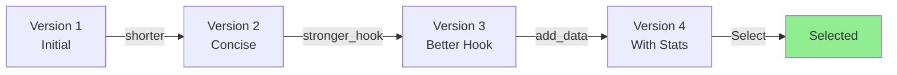

# Guide des Types d'Itérations

## Vue d'ensemble

Les itérations spécialisées permettent d'améliorer rapidement un post généré sans avoir à écrire un feedback détaillé. Chaque type applique une transformation spécifique et ciblée.

## 6 Types d'Itérations Spécialisées

### 1. 📏 shorter

**Objectif** : Réduire la longueur du post de ~30% tout en conservant l'essence

#### Quand l'utiliser

- Post trop long (> 500 mots)
- Manque de concision
- Plateforme avec limite stricte (X/Twitter)
- Besoin de version "TLDR"

#### Ce qui est conservé

✅ Message principal
✅ Points clés
✅ Call-to-action
✅ Ton et voix

#### Ce qui est supprimé

❌ Répétitions
❌ Détails secondaires
❌ Exemples redondants
❌ Phrases de remplissage

#### Exemple

**Avant (520 mots)** :
```text
I've been thinking a lot about productivity lately, and I wanted to share some thoughts with you all.

Over the past few years, I've tried countless productivity methods, systems, and tools. Some worked, some didn't. But there's one thing I've learned that stands out above everything else, and it's something that I wish someone had told me years ago when I was just starting my career.

The truth is, productivity isn't about doing more things. It's not about cramming more tasks into your day, or working longer hours, or using the latest app. I used to think that way. I would wake up early, work late, and fill every minute of my day with tasks. I thought I was being productive. But I was wrong.

Real productivity is about doing the RIGHT things. It's about focusing on what truly matters and saying no to everything else. When I started applying this principle, everything changed...

[continues for 300 more words]
```

**Après (350 mots)** :
```text
Real productivity isn't about doing more—it's about doing the RIGHT things.

I spent years cramming tasks into every minute. Wake up early, work late, fill every gap. I thought that was productivity. I was wrong.

What changed everything: focusing on what truly matters and saying no to the rest.

Here's what that looks like in practice:
• Identify your top 3 priorities each day
• Ruthlessly eliminate distractions
• Protect deep work time
• Say no to good opportunities to say yes to great ones

The result? I work less but accomplish more. My stress decreased. My impact increased.

What's your definition of productivity? 👇
```

**Réduction** : 520 mots → 350 mots (32% reduction)

---

### 2. 🎣 stronger_hook

**Objectif** : Améliorer les 2-3 premières lignes pour capter l'attention

#### Quand l'utiliser

- Hook faible ou générique
- Pas assez percutant
- Manque d'accroche émotionnelle
- Faible taux d'engagement

#### Techniques appliquées

- Question provocante
- Stat surprenante
- Statement controversé
- Teaser intrigant

#### Exemple

**Avant** :
```text
Let me share some thoughts about remote work.

Remote work has become increasingly popular over the past few years...
```

**Après** :
```text
Remote work is killing your career.

Controversial? Maybe. But hear me out...
```

**OU** :

```text
73% of remote workers say they're MORE productive.

Yet most companies still resist it. Here's why they're wrong...
```

---

### 3. 💭 more_personal

**Objectif** : Ajouter une touche personnelle, une anecdote authentique

#### Quand l'utiliser

- Post trop générique
- Manque de connexion émotionnelle
- Ton trop corporate
- Besoin d'authenticité

#### Ce qui est ajouté

✨ Anecdote personnelle
✨ Vulnérabilité
✨ Contexte spécifique
✨ Émotion authentique

#### Exemple

**Avant** :
```text
Delegation is important for leaders.

Many managers struggle with letting go of tasks. Learning to delegate effectively can improve team performance and free up your time for strategic work.
```

**Après** :
```text
I almost burned out trying to do everything myself.

Two years ago, I was working 70-hour weeks, convinced that no one could do it as well as I could. My team was underutilized. I was exhausted.

Then my co-founder sat me down: "You're not scaling. You're bottlenecking."

That hurt. But it was true.

I started small—delegated one project I'd been hoarding. Coached the person. Let them make mistakes. And you know what? They found a better solution than mine.

Now I ask myself: "Am I the only one who can do this?" If not, I delegate.

My workweek: 50 hours. My team's growth: exponential.

What's one thing you're holding onto that you should delegate?
```

---

### 4. 📊 add_data

**Objectif** : Inclure des statistiques, chiffres, ou données concrètes

#### Quand l'utiliser

- Post manque de crédibilité
- Arguments trop vagues
- Besoin de preuves
- Audience orientée data

#### Types de données ajoutées

- 📈 Statistiques
- 🔢 Métriques
- 📊 Études / Research
- 💰 ROI / Résultats chiffrés

#### Exemple

**Avant** :
```text
Email marketing still works really well for B2B companies.

If you're not using email, you're missing out on a powerful channel. Email allows you to reach your audience directly and build relationships over time.
```

**Après** :
```text
Email marketing delivers $42 ROI for every $1 spent (DMA, 2024).

Yet 63% of B2B companies still treat it as an afterthought.

Here's what the data shows:
• 81% of B2B buyers prefer email communication
• Personalized emails improve CTR by 14% (HubSpot)
• Nurtured leads produce 50% more sales at 33% lower cost

If you're not investing in email, you're leaving money on the table.

Our results after implementing these tactics:
→ Open rate: 34% (industry avg: 21%)
→ CTR: 4.2% (industry avg: 2.3%)
→ Revenue: +156% YoY

What's your email marketing strategy?
```

---

### 5. ⚡ simplify

**Objectif** : Réduire la complexité, supprimer le jargon

#### Quand l'utiliser

- Trop technique
- Jargon excessif
- Phrases complexes
- Audience non-experte

#### Transformations appliquées

| Avant | Après |
|-------|-------|
| Leverage synergies | Work together better |
| Utilize | Use |
| Implement a solution | Solve the problem |
| Facilitate | Help |
| Paradigm shift | Big change |

#### Exemple

**Avant** :
```text
Our platform leverages cutting-edge AI/ML algorithms to facilitate seamless cross-functional collaboration, enabling teams to optimize their workflows and maximize operational efficiency through intelligent task prioritization and resource allocation.
```

**Après** :
```text
Our platform uses AI to help teams work better together.

It automatically prioritizes your tasks and suggests who should work on what. The result? Teams finish projects 30% faster.

Simple as that.
```

---

### 6. ✏️ custom

**Objectif** : Appliquer un feedback spécifique de l'utilisateur

#### Quand l'utiliser

- Besoin d'un changement très spécifique
- Aucun type prédéfini ne correspond
- Feedback détaillé à appliquer

#### Exemples de feedback custom

```json
{
  "type": "custom",
  "feedback": "Add a specific example from the tech industry"
}
```

```json
{
  "type": "custom",
  "feedback": "Change the tone to be more controversial"
}
```

```json
{
  "type": "custom",
  "feedback": "Remove the question at the end and add a call-to-action to download our guide"
}
```

---

## Workflow Recommandé

### Approche itérative



### Exemple concret

1. **Génération initiale** → Post de 600 mots, hook faible
2. **Iteration `shorter`** → 400 mots, plus digeste
3. **Iteration `stronger_hook`** → Hook percutant ajouté
4. **Iteration `add_data`** → Stats pour crédibilité
5. **Sélection de la meilleure version**

---

## Comparaison des Types

| Type | Temps | Impact | Cas d'usage principal |
|------|-------|--------|----------------------|
| `shorter` | 5-10s | 🟢 Moyen | Posts trop longs |
| `stronger_hook` | 5-10s | 🟢 Élevé | Faible engagement |
| `more_personal` | 10-15s | 🟢 Élevé | Authenticité |
| `add_data` | 10-15s | 🟢 Élevé | Crédibilité |
| `simplify` | 5-10s | 🟢 Moyen | Trop technique |
| `custom` | Variable | Variable | Besoin spécifique |

---

## API Usage

### Request

```bash
POST /api/posts/{postId}/iterate
Authorization: Bearer {token}
Content-Type: application/json

{
  "type": "shorter",
  "maxTokens": 2000
}
```

### Response

```json
{
  "message": "Post iteration created successfully",
  "data": {
    "version": {
      "id": "uuid",
      "versionNumber": 2,
      "generatedText": "...",
      "iterationType": "shorter",
      "isSelected": false,
      "usage": {
        "promptTokens": 450,
        "completionTokens": 280,
        "totalTokens": 730
      }
    },
    "post": {
      "id": "uuid",
      "totalVersions": 2
    }
  }
}
```

---

## Bonnes Pratiques

### ✅ DO

- **Tester plusieurs types** - Essayez 2-3 types différents pour comparer
- **Itérer progressivement** - Ne faites pas tout d'un coup
- **Comparer les versions** - Gardez l'historique pour voir l'évolution
- **Utiliser les bons types** - Shorter pour longueur, add_data pour crédibilité, etc.

### ❌ DON'T

- **N'accumulez pas trop** - 3-4 itérations max par post
- **Ne changez pas radicalement** - Les itérations affinent, ne réécrivent pas tout
- **N'utilisez pas custom par défaut** - Les types spécialisés sont plus rapides

---

## Métriques de Succès

Après avoir utilisé les itérations, suivez :

- **Engagement rate** - Likes, comments, shares
- **Reach** - Combien de personnes ont vu le post
- **Version gagnante** - Quel type d'itération performe le mieux
- **Temps économisé** - vs écrire le feedback manuellement

---

## FAQ

**Q: Peut-on combiner plusieurs types ?**
A: Non directement, mais vous pouvez itérer plusieurs fois (ex: shorter puis stronger_hook).

**Q: Combien coûte une itération en tokens ?**
A: ~500-1000 tokens en moyenne (post moyen + instructions).

**Q: Peut-on annuler une itération ?**
A: Oui, chaque version est conservée. Revenez à la précédente via l'endpoint select.

**Q: Le type `custom` est-il aussi rapide ?**
A: Non, il nécessite de formuler le feedback, mais offre plus de contrôle.

---

*Documentation mise à jour: Décembre 2024*
